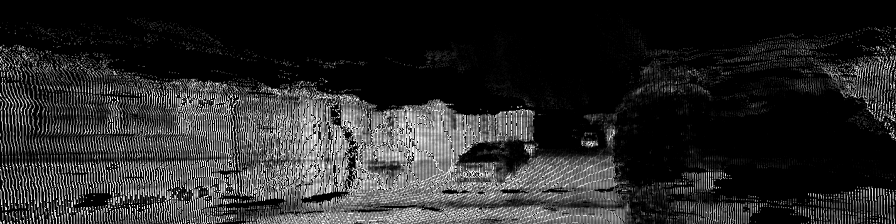

# Synthesizing LiDAR from RGB Image using generated dense LiDAR data from LiDAR Novel View Synthesis  

In this project, we trained Image translation model [SPADE](https://github.com/NVlabs/SPADE/) to generate LiDAR intensities in camera perspective conditioned on the RGB image from the camera. We utilize KITTI and KITTI-360 datasets for training the models.

We utilize [LiDAR4D](https://github.com/ispc-lab/LiDAR4D), a recent approach to LiDAR Novel View Synthesis, to generate dense LiDAR point cloud and use the projected intensities to train Image-to-Image translation models.

## Reults
| Experiment Setting                     | 66 Vertical Resolution | 300 Vertical Resolution                                                                   | 600 Vertical Resolution                                                                   |
|----------------------------------------|-----------------------------------------------------------------------------------------|------------------------------------------------------------------------------------------|------------------------------------------------------------------------------------------|
| RGB Image                              |         |        |        |
| Ground Truth                           |  |  |  |
| KITTI Pix2Pix (-1 masked)              |  |  |  |
| LiDAR4D (Projected points masked)      |  |  |  |
| LiDAR4D (-1 masked)                    |  |  |  |
| LiDAR4D (Unmasked)                     |  |  |  |

| Experiment Setting                     | 66 Vertical Resolution | 300 Vertical Resolution                                                                   | 600 Vertical Resolution                                                                   |
|----------------------------------------|-----------------------------------------------------------------------------------------|------------------------------------------------------------------------------------------|------------------------------------------------------------------------------------------|
RGB Image                              |         |        |        |
| Ground Truth                           |  |  |  |
| KITTI Pix2Pix (-1 masked)              |  |  |  |
| LiDAR4D (Projected points masked)      |  |  |  |
| LiDAR4D (-1 masked)                    |  |  |  |
| LiDAR4D (Unmasked)                     |  |  |  |

#### Data files and checkpoints:

https://drive.google.com/drive/folders/1rG8l0ZZa0umXQzeiCLBDX6x1AVLgRu10?usp=drive_link
